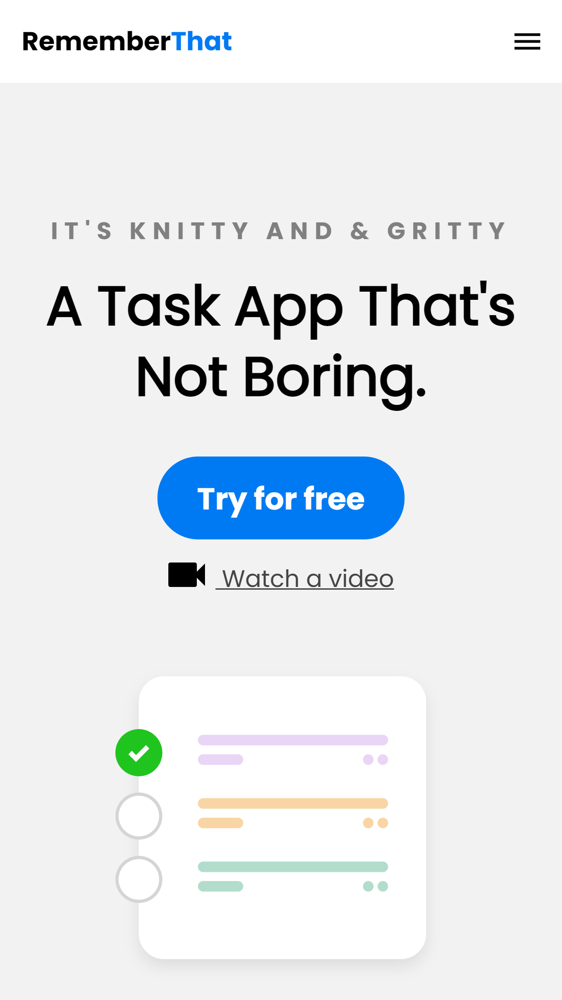
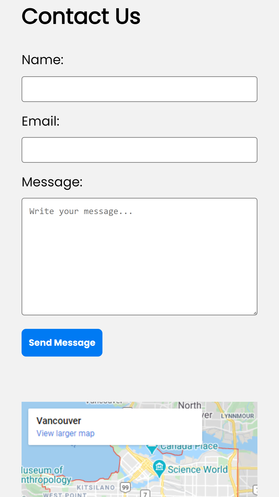

# DesignCourse HTML & CSS Mobile-First Website (Refresher) 🌐 

```sh 
Current project status: In Progress. ⌛  
```

This is a responsive website to get a refresher on HTML & CSS, along with dynamic styling with Sass and mobile-first approach when it comes to designing a website.

# ~ Google Maps Code Example: 👨🏿‍💻

HTML code block taken from Google Maps embed section from a selected location:

```sh

<iframe
    src="https://www.google.com/maps/embed?pb=!1m18!1m12!1m3!1d83327.3577568717!2d-123.193944225624!3d49.25782632080659!2m3!1f0!2f0!3f0!3m2!1i1024!2i768!4f13.1!3m3!1m2!1s0x548673f143a94fb3%3A0xbb9196ea9b81f38b!2sVancouver%2C%20BC%2C%20Canada!5e0!3m2!1sen!2sdo!4v1616781937837!5m2!1sen!2sdo"
    width="600"
    height="450"
    style="border: 0"
    allowfullscreen=""
    loading="lazy">
</iframe>

```

# ~ Project Previews: 🖼️

### ~ Mobile Version

Main Screen |  Sections Screen | Contact Screen
|:-----------:|:-----------:|:-----------:|
 |  | 

### ~ Desktop Version

Main Screen |  Second Screen |
|:-----------:|:-----------:|
 |  |


